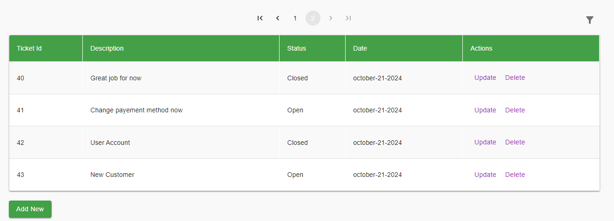
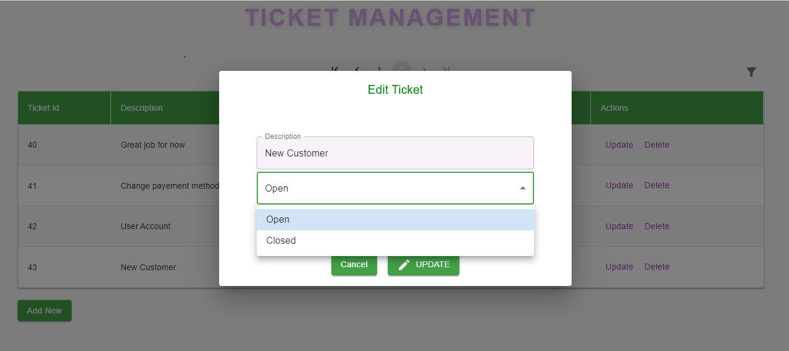
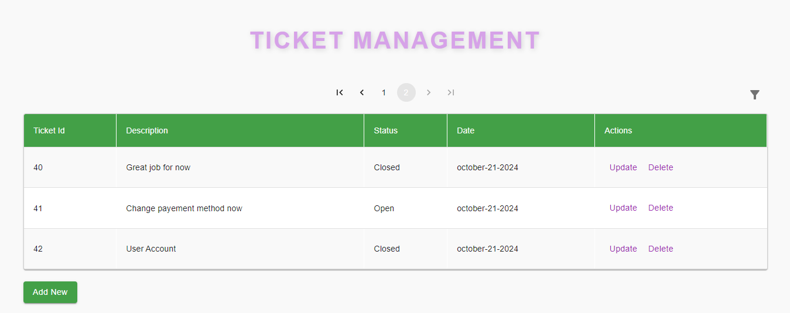
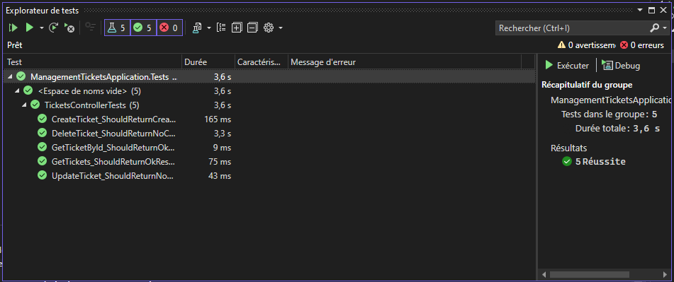

<h1 align="center">Ticket Management Web Application</h1>

  This project is a web application built using .NET 8 for the backend, React (TypeScript-based) for the frontend, and PostgreSQL for the database. 
  The application implements basic CRUD functionality (Create, Read, Update, Delete) for managing tickets. 
  It includes features such as ticket sorting, filtering, pagination, and form validation. 
  The user interface is styled using Material UI for a modern and responsive design.

<h2>Table of Contents</h2>
<ul>
  <li><a href="#features">Features</a></li>
  <li><a href="#installation">Installation</a></li>
  <li><a href="#usage">Usage</a>
    <ul>
      <li><a href="#ticket-list">Ticket List</a></li>
      <li><a href="#adding-a-new-ticket">Adding a New Ticket</a></li>
      <li><a href="#updating-a-ticket">Updating a Ticket</a></li>
      <li><a href="#deleting-a-ticket">Deleting a Ticket</a></li>
      <li><a href="#pagination">Pagination</a></li>
      <li><a href="#sorting">Sorting</a></li>
      <li><a href="#filtering">Filtering</a></li>
    </ul>
  </li>
  <li><a href="#technologies">Technologies</a></li>
</ul>

<h2 id="features">Features</h2>
<ul>
  <li>View, add, update, delete tickets</li>
  <li>Form validation with required fields</li>
  <li>Pagination for ticket lists (10 tickets per page)</li>
  <li>Sorting tickets by ID and creation date</li>
  <li>Filtering by ID, status, and description</li>
  <li>Modern responsive UI</li>
</ul>

<h2 id="installation">Installation</h2>

<ol>
  <li>Clone this repository:
    <pre>
      <code>
      git clone https://github.com/AssiaALFAIZ/ManagementTicketsApplication.git
      </code>
    </pre>
  </li>

<li>Install the required dependencies for both the frontend and backend:
  <ul>
    <li>Backend (API)
      <pre>
        <code>
        cd back
        launch ManagementTicketsApplication.sln
        update the ConnectionStrings in `appsettings.Development.json` within the ManagementTicketsApplication project
        execute the command `update-database` in the NuGet Package Manager Console
        </code>
      </pre>
    </li>
    <li>Frontend (UI)
      <pre>
        <code>
        cd front
        cd ticket-management
        npm install
        </code>
      </pre>
    </li>
  </ul>
</li>

  <li>Run the application:
    <ul>
      <li>Start the backend server:
        <pre>
          <code>
          start the project with https
          </code>
        </pre>
      </li>
      <li>Start the frontend:
        <pre>
          <code>
          npm start
          </code>
        </pre>
      </li>
    </ul>
  </li>
</ol>

<h2 id="usage">Usage</h2>

<h3 id="ticket-list">Ticket List</h3>

  Upon opening the application, users are presented with a list of all tickets. 
  The table contains key details such as Ticket ID, Description, Status, Creation Date, and actions for updating or deleting each ticket.

<h3 id="adding-a-new-ticket">Adding a New Ticket</h3>

  To add a new ticket, click the "Add New" button. This will open a form where you can enter a <strong>Description</strong> and select a <strong>Status</strong>. 
  The <strong>Description</strong> field is required, and the "Add" button will be disabled until the field is filled. 
  Once a valid description is entered, clicking "Add" will create the new ticket, assigning it a unique ID and creation date.

  In the first image i can't click in the add boutton because description is empty

  On successful ticket creation, a success message is displayed.

<h3 id="updating-a-ticket">Updating a Ticket</h3>

  Click the "Update" button next to any ticket. This will open a form where you can modify the ticket's <strong>Description</strong> and <strong>Status</strong>. 
  After making changes, click "Update". A success message will confirm that the ticket has been updated.

<h3 id="deleting-a-ticket">Deleting a Ticket</h3>

  To delete a ticket, click the "Delete" button next to the ticket. The ticket will be removed from the database.

<h3 id="pagination">Pagination</h3>

  The ticket list supports pagination, displaying 10 tickets per page. Use the pagination controls at the bottom to navigate between pages.

<h3 id="sorting">Sorting</h3>

  You can sort the ticket list by <strong>ID</strong> or <strong>Date</strong> by clicking the respective column headers.

You can sort the ticket IDs in ascending order by clicking the arrow next to the ID column.

You can sort the ticket IDs in desending order by clicking the arrow next to the ID column.

You can sort the date in ascending order by clicking the arrow next to the Date column.

You can sort the date in desending order by clicking the arrow next to the Date column.

<h3 id="filtering">Filtering</h3>

  By clicking on the gray filter icon located at the top of the ticket list, next to the pagination controls, users can filter tickets by <strong>ID</strong>, <strong>Status</strong>, or <strong>Description</strong>. 
  Use the search bar or filter dropdowns to narrow down the list.

<h2 id="unit tests">Unit Tests</h2>

I have indeed created unit tests for my backend to verify the APIs. As shown in the images, all tests for my APIs have passed successfully. You can test this in project 'ManagementTicketsApplication.Tests'.

<h2 id="technologies">Technologies</h2>
<ul>
  <li><strong>Backend</strong>: .NET 8, Entity Framework</li>
  <li><strong>Frontend</strong>: React, TypeScript, Material UI</li>
  <li><strong>Database</strong>: PostgreSQL</li>
</ul>

